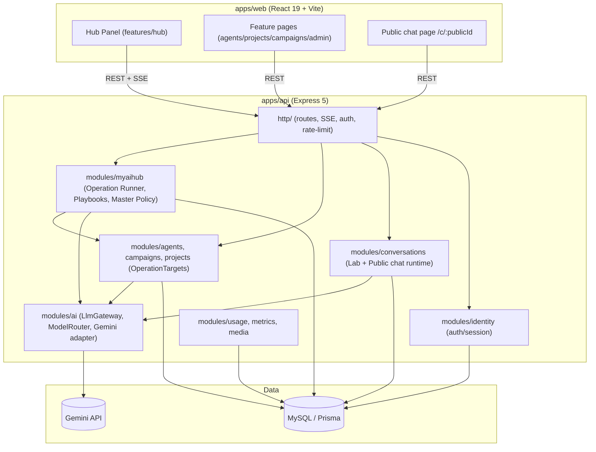
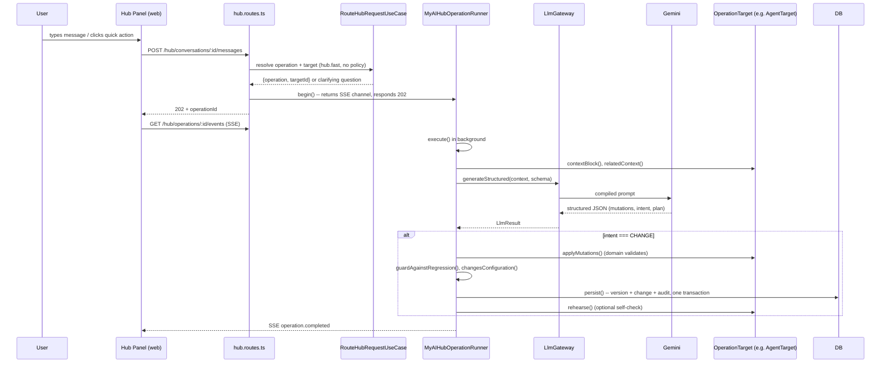
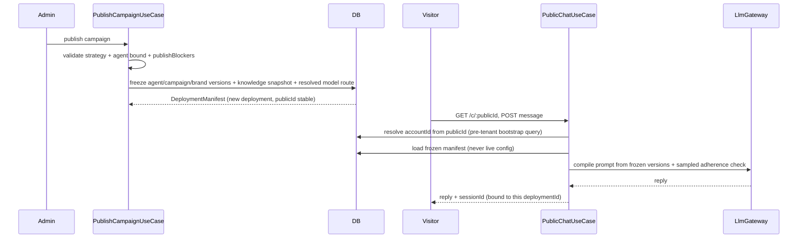

# Codebase Map

> Auto-generated by Cartographer. Last mapped: 2026-09-16T00:33:47Z. See also
> [`docs/ARCHITECTURE.md`](ARCHITECTURE.md) (source of truth for decisions/invariants)
> and [`docs/PANEL.md`](PANEL.md) (Hub panel UX rationale). This map is a navigation aid
> derived from reading the code; if it disagrees with ARCHITECTURE.md, ARCHITECTURE.md wins.

## System Overview

MyAIHub is a multi-tenant SaaS where each Account configures **Agents** (persona +
rules), **Projects** (business profile + brand + knowledge), and **Campaigns**
(an Agent bound to a Project with an objective). Everything is edited through a
typed operation system called **MyAIHub OS** ("the Hub") — either conversationally
(LLM proposes typed mutations, domain validates/applies) or manually (same typed
mutations, no LLM). Campaigns publish an immutable `DeploymentManifest` that a
public, unauthenticated chat serves.



## Directory Structure

```
apps/
  api/src/
    modules/
      myaihub/        # The OS: operations, canonical mutations, operation runner, playbooks, master policy
      ai/              # Provider-agnostic LLM gateway, Gemini adapter, model routing
      agents/          # Agent Core aggregate (compile-to-prompt, Lab, rehearsal)
      campaigns/       # Campaign Strategy aggregate + publication + public chat
      projects/        # Project Profile + Brand Identity + Knowledge sources
      conversations/    # Shared Lab/Public conversation runtime, state, evidence
      identity/         # Auth, sessions, accounts, audit log
      usage/            # AI call cost accounting, PTAX exchange rate
      metrics/          # Dashboard read models
      media/            # Uploaded image storage
    shared/
      application/      # Ports (Clock, IdGenerator, EventBus, TenantContext, ...)
      infrastructure/   # Prisma client + tenant guard, auth crypto, logging, SSE bus
      domain/           # AppError hierarchy
    http/                # Express app, middlewares, SSE helper, cookies, validation
    scripts/             # seed, smoke tests (real-provider verification)
    prisma/              # schema.prisma + migrations (13, one per phase)
    tests/               # Integration tests (real MySQL, per-worker DBs)
  web/src/
    app/                 # Shell, routing, navigation (URL-derived sidebar)
    design-system/        # Primitives, Sheet (native <dialog>), theme
    features/hub/         # The Hub panel: context resolution, SSE client, reducer, persistence, sound
    features/canonical/   # Manual mutation UI (EditableFacet) — same contract as the Hub
    features/agents|projects|campaigns|admin/  # CRUD pages + Lab (shared AgentLab component)
    features/metrics|conversations|models|usage|auth|public/
packages/shared/src/       # Zod contracts shared by api+web: canonical schemas, hub events, AI model catalog
docs/                       # ARCHITECTURE.md, PANEL.md (curated, not auto-generated)
```

## Module Guide

### `apps/api/src/modules/myaihub/` — The Operating System

**Purpose**: Executes every configuration change as a typed `MyAIHubOperation` —
never free-form chat. Owns the operation runner, canonical mutation appliers,
Master Policy (versioned prompt sections), and the Playbook ("craft") system.

**Entry point**: `presentation/hub.routes.ts` (`POST /hub/conversations/:id/messages`)

| File | Purpose |
|------|---------|
| `domain/operation.ts` + `agent/campaign/brand/playbook-operations.ts` | Declarative catalog of every operation: scope, target type, allowed/required mutations, output schema, policy sections, instruction prose |
| `domain/mutations.ts`, `mutation-applier.ts` | `CanonicalMutation` type + `ProjectProfileMutationApplier` (enforces invariants in code, never rejects on form errors — corrects and logs `VALUE_ADJUSTED`) |
| `domain/operation-target.ts` | `OperationTarget<TCanonical,TMutation,TKind>` port — the abstraction with 5 implementations (Project Profile, Brand Identity, Agent, Campaign, Playbook) |
| `domain/no-regression.ts` | `guardAgainstRegression()` — restores items that would shrink/disappear/downgrade without being asked |
| `domain/material-change.ts` | `changesConfiguration()` — detects no-op versions (bookkeeping-only diffs) so a "phantom version" is never created |
| `domain/playbook*.ts` | Playbook compilation, floor-mutation seeding (dedup against duplicate LLM-authored items), typed playbook mutations |
| `application/operation-runner.ts` | **The heart of the system** — context assembly → LLM call → mutation application → guard → persist (one transaction) → optional rehearsal |
| `application/route-request.use-case.ts` | Decides *which* operation + target from a free-text message, using account inventory (name→id), independent of which screen the user is on |
| `application/agent-rehearsal.ts` | Port only — asks "did this fix work?" without knowing how agents are compiled/run |
| `infrastructure/operation-targets.ts`, `playbook-target.ts` | Concrete `OperationTarget` implementations wired to real repositories |
| `infrastructure/prisma-hub.repositories.ts` | SSE event batching (flush at 25 events / operation end / before replay read) |
| `presentation/hub.routes.ts`, `admin.routes.ts`, `manual-edit.routes.ts` | Conversational endpoint, admin playbook CRUD, manual (non-LLM) mutation endpoint |

**Dependents**: everything — this module orchestrates `agents`/`campaigns`/`projects` via the `OperationTarget` port and calls `ai` via `LlmGateway`.

### `apps/api/src/modules/ai/` — LLM Provider Integration

**Purpose**: The only place allowed to talk to an LLM SDK. Routes by `ModelRole`
(`hub.reasoning`, `hub.fast`, `agent.runtime`, `validation.fast`, `analysis.vision`),
compiles context/prompt with trust segregation, retries transient failures, degrades
structured-output strategy to fit Gemini's schema limits.

| File | Purpose |
|------|---------|
| `domain/provider.ts` | `LlmProvider` port; `StructuredOutputError` carries `usage` so a schema-rejected call still bills |
| `domain/context.ts` | `ContextBlock` (`POLICY/STABLE/DYNAMIC/KNOWLEDGE/UNTRUSTED`); `essential` separates ordering from eviction priority |
| `application/context-compiler.ts` | Fixed block order for cache-prefix stability; evicts lowest-priority non-essential blocks first |
| `application/prompt-compiler.ts` | **§9.1 invariant**: `UNTRUSTED` content can never enter `systemInstruction` — wrapped in a nonce-delimited region, escaped |
| `application/model-router.ts`, `model-route-store.ts` | Role → provider/model; precedence: free-tier lock > admin's saved choice > env default |
| `application/llm-gateway.ts` | **Single funnel** for every LLM call; per-role timing budgets; always records `AiCallOutcome` (success or failure) |
| `application/served-tier.ts` | Fact (not prediction) of which quota tier actually served the last call — survives restarts via DB seed |
| `infrastructure/providers/gemini-provider.ts` | Gemini adapter; asymmetric first-token timeouts (short first try, longer retry); stall vs. empty-response distinction; JSON-mode fallback |
| `infrastructure/providers/gemini-keys.ts` | Free/paid key fallback — half-open circuit breaker (no balance API exists) |
| `infrastructure/providers/gemini-schema.ts` | Flattens discriminated unions / strips nesting to fit Gemini's `responseJsonSchema` limits |
| `infrastructure/providers/fake-provider.ts` | **Permanent** deterministic test double — all automated tests use it, even with real keys present |

**Dependents**: `myaihub` (operation runner), `agents`/`campaigns`/`projects` (indirectly via runner), `conversations` (Lab/Public chat runtime).

### `apps/api/src/modules/agents/` — Agent Core (`OperationTarget` #1)

**Purpose**: The Agent aggregate — personality/communication/skills/behaviors/
strategies/hardRules/limits facets, compiled into the runtime system prompt.

| File | Purpose |
|------|---------|
| `domain/agent-prompt.ts` | Compiles `CanonicalAgent` (+ optional Campaign/Project/Brand/knowledge/test-scenario) into the system prompt; hoists all `HARD`/`DETERMINISTIC` items from agent+project+campaign into one binding block |
| `domain/mutations.ts` | `agentMutationsSchema` — unknown `kind` values dropped via preprocess, not batch-rejected |
| `domain/mutation-applier.ts` | Upsert-by-`semanticKey` merges into existing item (preserves `id` across refinements) |
| `application/agent-rehearsal.service.ts` | Re-runs the failing turn against the just-saved config; judged by a cheap `validation.fast` call |
| `application/plan-agent-briefing.use-case.ts` | Classifies a role against the Playbook catalog or generates 2–4 pre-creation questions; skips the LLM entirely if the frontend already picked a playbook key |
| `application/test-agent.use-case.ts` | The Lab; deterministic checks run synchronously, semantic adherence runs async (non-blocking) |

**Dependents**: `myaihub` (AgentTarget), `campaigns` (bound agent), `conversations` (runtime compile).

### `apps/api/src/modules/campaigns/` — Campaign Strategy + Publication (`OperationTarget` #2)

**Purpose**: Campaign aggregate (audience/discoveryDimensions/strategy/
conversionBehavior/knowledgeScope/rules) + the publish/freeze pipeline + the
unauthenticated public chat.

| File | Purpose |
|------|---------|
| `domain/manifest.ts` | `DeploymentManifest` v1→v2 (adds brand+knowledge snapshot ids); `hashManifest()` canonical/deterministic |
| `domain/repositories.ts` | `PublicDeploymentLookup` — the one query allowed to run before a tenant context exists |
| `application/publish-campaign.use-case.ts` | Freezes agent/campaign/brand versions + resolved model route + knowledge snapshot into an immutable manifest |
| `application/public-chat.use-case.ts` | 4 invariants: `accountId` never from request; runs over frozen manifest; server-side history; session dies with the deployment |

**Dependents**: `myaihub` (CampaignTarget), `conversations` (public chat sessions).

### `apps/api/src/modules/projects/` — Project Profile + Brand + Knowledge (`OperationTarget` #3)

**Purpose**: Business profile (audiences/offerings/valuePropositions/
differentiators/market/businessRules — the last is the only facet with runtime
binding force), Brand Identity (singleton, non-itemized document), and
client-owned Knowledge sources (read-only to the OS, keyword-retrieved).

| File | Purpose |
|------|---------|
| `domain/brand-mutation-applier.ts` | Field-level merge (never whole-document replace); WCAG contrast auto-computed only if user didn't specify text color |
| `domain/knowledge-retriever.ts` | Deliberately keyword-based (not vector) — MVP scope decision, swappable via port |
| `application/manage-knowledge.use-case.ts` | Extraction is synchronous at creation — no queue, so failures are visible immediately |
| `infrastructure/brand-identity.target.ts` | Simplest `OperationTarget` — proves the abstraction needs no facets to function |

**Dependents**: `myaihub` (ProjectProfileTarget, BrandIdentityTarget), `campaigns` (published snapshot).

### `apps/api/src/modules/conversations/` — Shared Runtime (Lab + Public Chat)

**Purpose**: One `ConversationService` used by both the Lab and the public chat
so a fix lands in both channels at once. Owns turn state merging, deterministic
event derivation, and the async (non-blocking) semantic adherence check.

| File | Purpose |
|------|---------|
| `domain/state.ts` | `mergeConversationState()` — never full overwrite; `deriveTurnEvents()` — one `RULE_VIOLATION` per violation for dashboard aggregation |
| `application/conversation.service.ts` | `resolveSession` rejects mismatched agent/campaign session instead of silently starting a new one |
| `application/pending-adherence.ts` | In-memory (not persisted) `CHECKING/CHECKED/UNAVAILABLE` map — turn returns immediately, client polls; absent state must map to `UNAVAILABLE`, never a silent "clean" |

### `apps/api/src/modules/identity/`, `usage/`, `metrics/`, `media/`

- **identity**: register/login/refresh/logout, refresh-token rotation with reuse
  detection (steals-token response revokes all sessions), scrypt password hashing,
  audit log with cross-tenant elevation flow (`ADMIN` + `X-Elevation-Reason`, 404
  not 403 for non-admins).
- **usage**: `AiModelPricing`/`AiCall` cost accounting in integer micros-of-USD;
  PTAX (Brazilian Central Bank) exchange rate, cached with background refresh.
- **metrics**: fixed-window (7/30/90d, UTC) dashboard aggregates, derived only —
  no parallel incrementing counters.
- **media**: uploaded images validated by file-header magic bytes (never
  client-supplied `Content-Type`), stored behind a `MediaStorage` port.

### `apps/api/src/shared/` — Cross-cutting Infrastructure

**Tenant scoping** (critical invariant): `TenantContext` passed explicitly to every
use case/repository, backed by an `AsyncLocalStorage`-fed Prisma `$extends` guard
(`tenant-guard.ts`) that rejects `findUnique({where:{id}})` on tenant-scoped models
and requires `accountId` in every read/write `where`. `tenant-policy.ts` is a
hardcoded classification registry — any model absent from it throws at guard time.
**Gotcha**: `runWithTenantContext` must `await` inside the callback — `AsyncLocalStorage.run`
restores the previous scope the instant the sync callback *returns*, before a
Prisma promise is awaited.

Other shared infra: `bootstrap.ts` (migration-pending detection, dev-only
auto-migrate+seed, prod-only schema assertion), `in-memory-event-bus.ts` (SSE
backing bus, ring buffer, swallows subscriber exceptions), `jose-token-service.ts`
(JWT), `scrypt-password-hasher.ts`, `web-content-reader.ts` (SSRF-defended URL
fetch for cited-URL context).

### `apps/api/src/http/` — Express App Assembly

`app.ts` wires helmet/cors/json/cookies → `requestContext` → `accessLog` →
`generalRateLimit` → module routers → error handler. `sse.ts` implements
`Last-Event-ID` replay + live subscription with seq-based dedup. Rate limits:
general 300/min, auth 20/15min, public chat 20/min (the one unauthenticated
surface that spends paid API budget). `error-handler.ts` maps `AppError`/`ZodError`/
Prisma schema-drift codes to one `ApiErrorBody` shape; never leaks internals in prod.

### `apps/web/src/features/hub/` — The Hub Panel (Frontend)

**Purpose**: Conversational + SSE-driven UI for the OS. Context/greeting/quick-actions
are resolved **in code from the route** (`contextual-actions.ts`), never via LLM call.

| File | Purpose |
|------|---------|
| `contextual-actions.ts` | `resolveHubContext(pathname, ...)` — pure, deterministic scope resolution; quick-action prompts pre-fill, never auto-send |
| `HubProvider.tsx` | Reducer-based state, one conversation id per scope key, `sessionStorage` persistence with a `restored` guard against a read/write race |
| `hub.api.ts` | `useHubOperationStream` — `EventSource` SSE client (cookie-authed, custom event name from `@myaihub/shared`) |
| `hub-state.ts` | Reducer mirroring the SSE event union (plan/trace/progress/delta/completed) into `HubState` |
| `hub-persistence.ts` | `sessionStorage` (not `localStorage`, deliberately) — history dies with the login session |
| `sound.ts` | Synthesized (Web Audio, no assets) completion chime, plays only when the tab/window isn't focused |
| `HubPanel.tsx` | The panel UI itself (1099 lines) — composer, transcript, progress, quick actions, cost badges |

### `apps/web/src/features/canonical/EditableFacet.tsx`

The manual-editing counterpart to the Hub: same typed mutation endpoint
(`manual.api.ts` → `/api/{resource}/:id/mutations`), `source: 'USER'`. Hub is for
*intent*, this is for *correction* — both funnel into the same domain applier.

### `packages/shared/src/` — Cross-boundary Contracts (`@myaihub/shared`)

**Rule**: contracts only — Zod schemas/types/enums, zero I/O, zero business logic.
Key exports: `AI_MODEL_CATALOG` (provider/model list shared by admin UI + API
validation), `HubScope`/`HUB_SCOPES`, `HubEvent` (SSE protocol union), per-aggregate
facet-mutation vocabularies (`AGENT_FACET_MUTATION`, `CAMPAIGN_FACET_MUTATION`,
`PROJECT_FACET_MUTATION` — manual edits must construct the same mutation names the
LLM constructs, or the UI "saves" while the API silently rejects), `canonical/`
(the `CanonicalItem`/schema-migration engine shared by Agent/Campaign/Project/
Brand), `ERROR_CODES`.

## Data Flow

### A conversational Hub operation



### Publishing and serving a public campaign



## Conventions

- **Canonical documents**: every configurable aggregate (Agent, Campaign, Project
  Profile, Playbook) is a facet-based document of `CanonicalItem`s with
  `id`/`code`/`semanticKey` triple identity, `enforcement` (`SOFT`/`HARD`/
  `DETERMINISTIC`), and `source` provenance (`USER`/`MYAIHUB`/`MYAIHUB_BASELINE`/`SYSTEM`).
- **One mutation kind per facet** — never a generic "upsert item," so an
  operation's `allowedMutations` whitelist can actually constrain what an LLM
  proposes.
- **Upsert-by-`semanticKey`** merges into the existing item, preserving the
  technical `id` — iterative refinement converges instead of duplicating.
- **Form errors are auto-corrected in code; content is never discarded** — wrong
  semantic-key prefix, unknown mutation `kind`, missing checker: all corrected
  or downgraded with an audit trail, never a wholesale rejection.
- **Ports/adapters**: `domain/` and `application/` never import Prisma, Express,
  or a provider SDK — everything crosses through a port defined in that layer.
- **Tenant scoping**: `findFirst({where:{id, accountId}})`, never
  `findUnique({where:{id}})`, on any tenant-scoped model.
- **Português** in comments/errors/UI/test names; English identifiers/types.
- Imports: `.js` extensions in the backend (NodeNext), no extension in the
  frontend (bundler resolution) — mixing these breaks at runtime, not typecheck.

## Gotchas

- **`thinkingBudget` must never be set on chat turns** — declaring even a low
  value *enables* a reasoning pass that otherwise never fires, and reasoning
  tokens don't count toward first-token latency (the stall watchdog can fire
  mid-"thought").
- **`AsyncLocalStorage.run` restores tenant scope the instant the sync callback
  returns** — a bare `() => db.query()` silently loses the elevated scope if the
  promise isn't awaited *inside* the callback.
- **`z.toJSONSchema` cannot handle `.transform()`** — every "correct on read"
  field uses `z.preprocess` instead, or the entire structured-output schema
  build fails at 0ms, before any network call.
- **Gemini's `responseJsonSchema` has an undocumented complexity ceiling**
  (~10 aggregate properties, no nested object-in-array) — the adapter degrades
  to JSON-mode automatically; don't shrink the domain's canonical contract to
  fit a provider limit.
- **A stalled first LLM attempt is free (no tokens billed); a stalled retry is
  not** — timeouts are deliberately asymmetric (short leash first try, longer
  leash on retry).
- **Migrations use hand-numbered "Fase" (phase) names** — schema evolves in
  discrete, documented product phases, not organically.
- **`prisma migrate dev` can reset the dev database on drift** — the warning
  prints at the *start* of its output, easy to miss if only the tail is read;
  prefer `migrate diff --script` + manual review for anything destructive.
- **`sessionStorage`, not `localStorage`, for Hub panel history** — deliberate:
  stale answers about since-changed configuration must not survive a fresh login.

## Navigation Guide

- **Add a new OS operation**: define it in `apps/api/src/modules/myaihub/domain/*-operations.ts`
  (scope, target type, allowed/required mutations, output schema, instruction),
  register in `operation.ts`, ensure the target's `OperationTarget` implementation
  exists in `infrastructure/operation-targets.ts` (or `playbook-target.ts`).
- **Add a canonical facet/mutation**: define the schema in `packages/shared/src/canonical/`
  first (shared contract), then the mutation kind + applier logic in the owning
  module's `domain/mutations.ts` / `mutation-applier.ts`, then update the
  compile-to-prompt function (`agent-prompt.ts` etc.) if it should reach runtime.
- **Add/modify a Hub quick action or context rule**: `apps/web/src/features/hub/contextual-actions.ts`
  — pure function, no LLM call, keep it that way.
- **Change model routing behavior**: `apps/api/src/modules/ai/application/model-router.ts`
  + `model-route-store.ts`; admin UI is `apps/web/src/features/models/`.
- **Touch tenant-scoped data access**: read `docs/ARCHITECTURE.md` §12 and
  `apps/api/src/shared/infrastructure/prisma/tenant-*.ts` first — any new Prisma
  model must be classified in `tenant-policy.ts` or the guard fails closed.
- **Debug a stuck/slow LLM call**: `apps/api/src/modules/ai/infrastructure/providers/gemini-provider.ts`
  (retry/timeout constants are heavily tuned and documented with measured data —
  read the comments before changing a number).
- **Change public-chat behavior**: `apps/api/src/modules/campaigns/application/public-chat.use-case.ts`
  — remember the 4 invariants (server-derived accountId, frozen manifest,
  server-side history, session bound to deployment).
